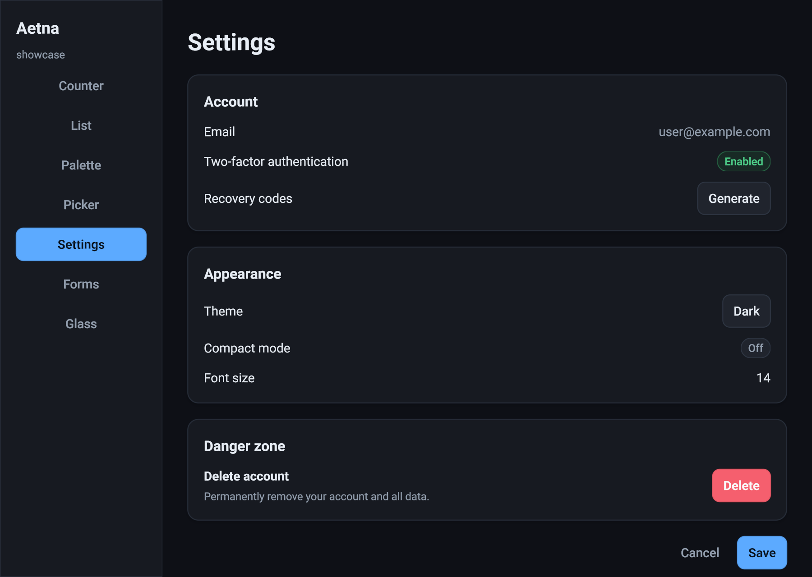
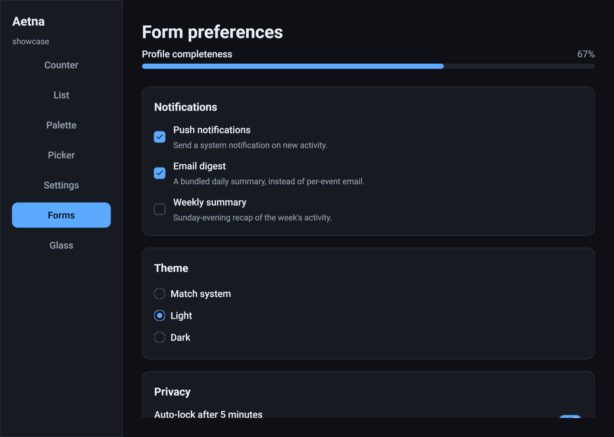
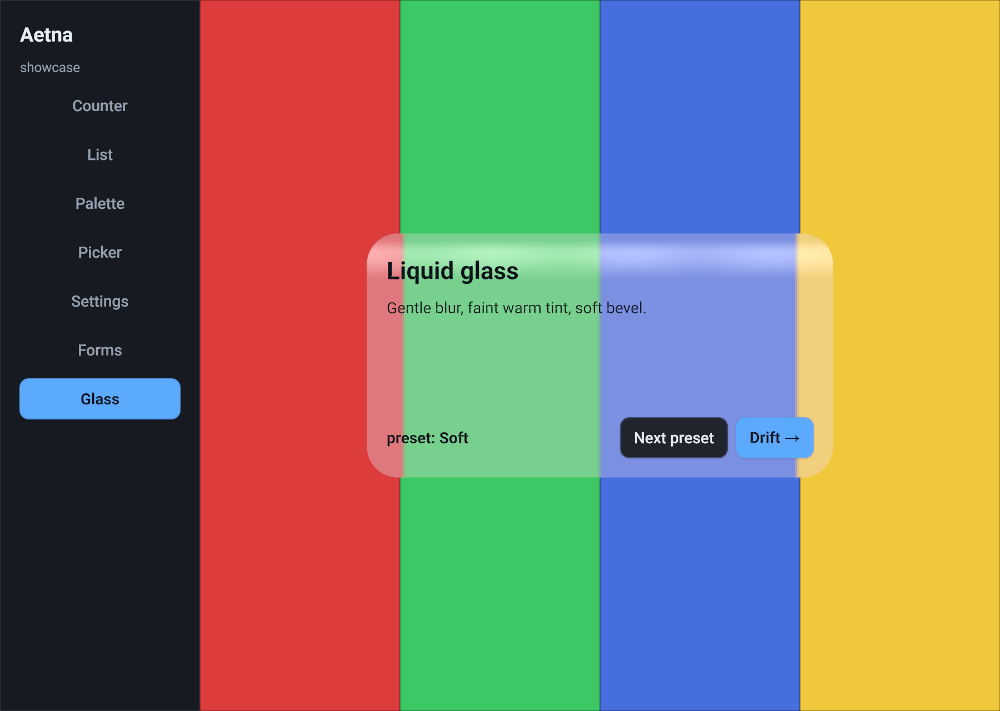
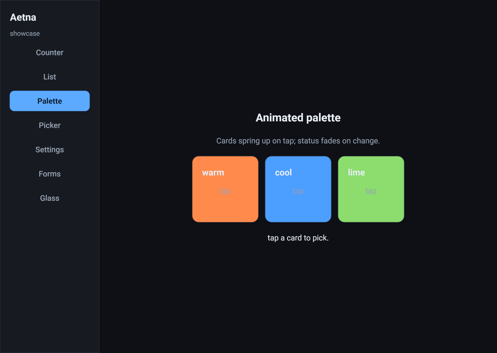

# Aetna



A thin UI rendering library that can insert into an existing Vulkan or wgpu renderer rather than owning the device, queue, or swapchain. The core/backends don't replace the host's renderer; they share its pass. For simple desktop apps, the workspace also ships an optional winit + wgpu host crate that packages the common window/surface loop. The name echoes the API it sits on — Vulkan is named for Vulcan, the Roman smith-god, and Mt. Aetna is the volcano where his forge stood.

Aetna is shaped around how **an LLM** authors UI, not how a human web developer does. The thesis: when the author is a model, the load-bearing constraints flip — vocabulary parity with the training distribution matters more than configurability, the *minimum* output should be the *correct* output, and the visual ceiling is set by what shaders the model can write, not by what the framework's CSS-shaped surface exposes.

Two architecture notes live under `docs/` — read these before reviewing. They are deliberately independent:

- **`docs/SHADER_VISION.md`** — the *rendering* layer. Current backend boundaries, paint-stream contract, shader/material model, backdrop-sampling contract, and host-integration split.
- **`docs/LIBRARY_VISION.md`** — the *application* layer. Current app/widget model, public surfaces an LLM author should see after crates.io packaging, crate layering, controlled-widget policy, and stability questions before serious app ports.

Open work is tracked in [`TODO.md`](TODO.md).

## Workspace shape

Aetna lives under `crates/`, with runnable cross-crate examples in the workspace `examples/` package:

| Crate | Role |
|---|---|
| `aetna-core` | Backend-agnostic core. Tree (`El`), layout, draw-op IR, stock shaders + custom-shader binding, animation primitives, hit-test, focus, hotkeys, lint + bundle artifacts. Plus the cross-backend paint primitives (`paint::QuadInstance` + paint-stream batching) and `runtime::RunnerCore` (the interaction half every backend `Runner` composes). No backend deps. |
| `aetna-wgpu` | wgpu pipelines + per-page atlas textures + `Runner` shell. Wraps a shared `RunnerCore` from `aetna-core` for interaction state, paint-stream scratch, and the `pointer_*`/`key_down`/`set_hotkeys` surface; only GPU resources and the wgpu-flavoured `prepare()` GPU upload + `draw()` are backend-specific. |
| `aetna-fixtures` | Workspace-private backend-neutral showcase apps and render fixtures (`Showcase`, icon gallery, text-quality matrix, liquid-glass lab). No windowing or GPU setup; examples, web, tools, and backend parity crates import the same fixtures for parity. Not a public dependency target. |
| `aetna-winit-wgpu` | Optional batteries-included native desktop host for simple winit + wgpu apps. Owns window/surface setup, MSAA target management, input mapping, IME forwarding, redraw-on-animation, plus opt-in host cadence / `before_build` hooks for live external state. Custom hosts can bypass it and call `aetna-wgpu::Runner` directly. |
| `aetna-examples` | Workspace examples package (`examples/`). User-facing interactive examples that intentionally pull multiple crates: `aetna-core` + `aetna-winit-wgpu`, plus `aetna-fixtures` or native helpers where needed. |
| `aetna-web` | Workspace-private wasm browser entry point. `crate-type = ["cdylib", "rlib"]`; re-exports `aetna_fixtures::Showcase` and ships a `#[wasm_bindgen(start)] start_web()` that opens a wgpu surface against an `<canvas id="aetna_canvas">` and drives the same backend-neutral App impl that native demos use. |
| `aetna-vulkano` | Vulkan backend, peer to `aetna-wgpu`. WGSL → SPIR-V via `naga`; `Runner` mirrors `aetna_wgpu::Runner`'s public surface with `Arc<Device>`/`Queue`/`Format` constructor args. The interaction half + paint-stream loop route through the shared `RunnerCore` so behaviour cannot drift between backends. |
| `aetna-vulkano-demo` | winit + vulkano harness sibling of the wgpu demo path. Ships `bin/counter` (the boundary A/B fixture), `bin/custom` (the gradient WGSL fixture), and `bin/showcase` (driving the same `aetna-fixtures::Showcase` app through `aetna-vulkano`). |

The architectural decision: `El` is the author's description of the scene; everything the library writes during a frame — computed rects, hover/press/focus state, envelope amounts, scroll offsets, animation tracker entries — lives in `UiState` side maps keyed by `El::computed_id`. The build closure produces a fresh `El` carrying zero library state; the runtime layer holds the state across rebuilds.

## Capabilities

| Capability | What it covers and how to see it |
|---|---|
| Grammar | `column`/`row`/`card`/`button`/`badge`/`text`/`spacer`, intrinsic + `Fill`/`Hug`/`Fixed` sizing, `pub const` tokens. |
| Theme palettes | shadcn-shaped color tokens with copied `zinc` and `neutral` dark/light palettes plus a Radix Colors `slate` + `blue` dark/light pair. `Theme::aetna_dark()` and `Theme::aetna_light()` default to shadcn zinc; explicit constructors are `Theme::shadcn_zinc_dark()`, `Theme::shadcn_zinc_light()`, `Theme::shadcn_neutral_dark()`, `Theme::shadcn_neutral_light()`, `Theme::radix_slate_blue_dark()`, and `Theme::radix_slate_blue_light()`. `cargo run -p aetna-core --example palette_demo` renders every stock palette. |
| Wgpu rendering | `cargo run -p aetna-examples --bin settings`; `cargo run -p aetna-wgpu --example render_png` writes `crates/aetna-wgpu/out/settings.wgpu.png` |
| Stock shaders | `rounded_rect` + `text_sdf` + `focus_ring` |
| Custom-shader escape hatch | `crates/aetna-wgpu/out/custom_shader.wgpu.png` — gradient buttons rendered by user-authored `shaders/gradient.wgsl` |
| Custom-layout escape hatch | `El::layout(f)` accepts a `LayoutFn(LayoutCtx) -> Vec<Rect>` that replaces the column/row/overlay distribution for a node's children. The library still recurses, still drives hit-test/focus/animation/scroll off the produced rects. `cargo run -p aetna-core --example circular_layout` → `crates/aetna-core/out/circular_layout.svg`; `cargo run -p aetna-examples --bin circular_layout` (interactive compass rose, click-routed through LayoutFn-produced rects) |
| Virtualized list | `virtual_list(count, row_height, build_row)` realizes only the rows whose rect intersects the viewport. Wheel events route via the existing scroll machinery; computed_ids derive from row keys so hover/press/focus state survives scrolling. `cargo run -p aetna-core --example virtual_list` (10k rows); `cargo run -p aetna-examples --bin virtual_list` (100k rows, interactive). Variable-height rows not yet supported. |
| App trait + hit-test + automatic hover/press | `cargo run -p aetna-examples --bin counter` (interactive); `crates/aetna-wgpu/out/counter.wgpu.png` |
| HiDPI text + shaped core layout + paragraph wrapping + text alignment | bundled Roboto, `cosmic-text` core layout + swash rasterization, core-owned glyph atlas. SVG fallback (`crates/aetna-core/out/settings.svg`) aligned with wgpu output |
| Clip + modal/overlay | `cargo run -p aetna-core --example modal` → `crates/aetna-core/out/modal.svg` |
| Scroll viewport | `cargo run -p aetna-core --example scroll_list` → `crates/aetna-core/out/scroll_list.svg`; `cargo run -p aetna-examples --bin scroll_list` (interactive, wheel) |
| Host-painted regions | reserve a keyed node in the tree, call `Runner::rect_of_key("viewport")` after `prepare()`, and let the host renderer paint into that rect |
| Focus traversal + keyboard routing | Tab / Shift+Tab / Enter / Space / Escape in any interactive demo |
| Hotkey system | `cargo run -p aetna-examples --bin hotkey_picker` — `j`/`k` movement, Ctrl+L, `/`, etc., zero per-key matching in the app |
| Animation primitives | spring + tween + per-(node, prop) tracker; library-owned hover / press / focus envelopes auto-ease on every keyed interactive node; author-facing `.animate(timing)` + `.opacity` / `.translate` / `.scale` for app-driven prop interpolation; `prepare()` returns `needs_redraw` so frames tick only while motion is in flight. `cargo run -p aetna-examples --bin animated_palette` |
| Rich text | attributed runs, per-glyph color / weight / italic / strikethrough, hard breaks, paragraph alignment shared between SVG fallback and GPU paths. `cargo run -p aetna-core --example inline_runs` → `crates/aetna-core/out/inline_runs.svg` |
| Inline text decorations | `.underline()`, `.strikethrough()`, `.link(url)` modifiers on text runs; runs sharing the same URL group together for hit-test. Renders identically through SVG fallback and the GPU path. |
| Static-text selection | `.selectable()` opt-in on any text leaf; pointer drag selects across multiple leaves and the painter draws a selection band behind the glyphs of every covered run. Double-click selects a word; triple-click selects a line / leaf; Esc clears. `Selection` is one app-owned value: the app returns it from `App::selection`, and `UiEventKind::SelectionChanged` lets `on_event` mirror the runtime's update back into app state. `text_input` / `text_area` participate in the same global model, so clicking in a paragraph dismisses input selection and vice versa. Linux primary-selection is wired through `arboard`'s `wayland-data-control`. `cargo run -p aetna-examples --bin text_selection` |
| Caret blink | `text_input` / `text_area` blink the caret while focused; runtime input paths bump caret activity so typing, clicking, and arrow movement keep the caret solid through interaction and reset the phase afterwards. |
| Pointer cursor model | `.cursor(Cursor::Pointer / Text / Grab / Grabbing / Move / NotAllowed / …)` on any El. Each frame `UiState` resolves the active cursor (press-target wins during drags, otherwise the hovered-ancestor walk picks the first explicit cursor); `aetna-winit-wgpu` forwards to `Window::set_cursor` and `aetna-web` forwards to `canvas.style.cursor`. Stock widgets are pre-annotated — buttons / switches / checkboxes get `Pointer`, text inputs and selectable text get `Text`, the slider toggles `Grab` ↔ `Grabbing` across the press. |
| Scrollbar polish | `scroll(...)` and `virtual_list(...)` paint a draggable thumb with hover-expand and click-to-page (clicking the track shifts the offset by ~one viewport in the click direction, with a small overlap to preserve context). Drag captures globally, matching native scrollbars. |
| Resize handle | `resize_handle(Axis::Row / Column).key(k)` is a sibling primitive between two panes; the app owns the size state and folds drag events through `resize_handle::apply_event_fixed` (one fixed pane + one filling pane) or `apply_event_weights` (two weighted panes), or builds its own handler on `delta_from_event`. 8px hit area, no Tab trap. Showcase `Section::Split` exercises it. |
| Form scaffolding | `field_row("Label", control)` is the labelled-row primitive — left label, right control, vertical-center, full-width. Pure composition over `row` + `text.label()` + `spacer`; apps can fork the file and produce equivalents. `slider::apply_input` adds the small-amount/page-amount step semantics on top of `apply_event` for sliders driven by both pointer and keyboard. |
| Raster images | `image(Image::from_rgba8(width, height, pixels))` widget paints app-supplied RGBA pixels through a per-image GPU texture cache on both wgpu and vulkano. `ImageFit::Contain / Cover / Fill / None` projects natural pixel size into the resolved rect; `.image_tint(c)` recolors. `Section::Images` in the showcase is the parity fixture. |
| Toast notifications | apps accumulate `ToastSpec::success("…") / .warning(...) / .error(...) / .info(...)` and return them from `App::drain_toasts`; the runtime pushes them onto `UiState` and synthesizes a toast layer into the root after `build()` returns (same library-driven extension pattern as tooltips). TTL-driven auto-dismiss; explicit dismissals route as `{key}:dismiss` events. Requires an `Axis::Overlay` root so the synthesizer has somewhere to append. `Section::Toasts` exercises every level. |
| App-supplied SVG icons | `icon(SvgIcon::parse_current_color(include_str!("path.svg")))` paints any `currentColor` SVG through the same icon pipeline used for built-in `IconName`s; `icon_button(source)` wraps it with the standard interactive surface. Unknown string-typed icon names render an empty box rather than panicking. |
| Backdrop sampling | multi-pass render API + snapshot copy + `@group(1)` backdrop sampler made available to custom shaders; `liquid_glass.wgsl` is the architectural acceptance test. `cargo run -p aetna-tools --bin render_liquid_glass`; runs identically through wgpu native, vulkano native, and WebGPU |
| Widget kit + input plumbing | symmetry invariant — stock widgets compose only public surface (`capture_keys`, `paint_overflow`, `LayoutCtx::rect_of_key`, controlled state helpers, etc.). `crates/aetna-core/src/widget_kit.md` is the author contract; every stock widget under `crates/aetna-core/src/widgets/` is a pure composition. `PointerDown`, `SecondaryClick`, drag tracking, character / IME `TextInput` events, focused-node key capture, and `metrics::hit_text` are kit-public primitives. `UiState::widget_state` exists for advanced host/diagnostic experiments, not normal app widget code. |
| `text_input` / `text_area` | single + multi-line editing through app-owned `(value, Selection)` state, drag-to-select, shift-arrow extension, Ctrl+A/C/X/V via app-owned clipboard (`text_input::clipboard_request` detects keystrokes; app dispatches against `arboard` natively or web Clipboard API), preferred-column up/down motion, line-wise Home/End. Both widgets share the same controlled selection shape and public `apply_event` helpers. Built using only the public widget kit. `cargo run -p aetna-examples --bin text_input`; `cargo run -p aetna-examples --bin text_area` |
| Anchored popovers | two-pass layout positioning a popover relative to a trigger key (current-frame rect, no staleness); viewport-edge auto-flip; click-outside / Escape dismiss. `dropdown` and `context_menu` are compositions of `popover` + `popover_panel` + `menu_item` — no extra runtime wiring. Kit primitive: `LayoutCtx::rect_of_key` (any custom layout can position relative to keyed elements outside its own subtree). `cargo run -p aetna-examples --bin popover` — top dropdown, bottom dropdown (auto-flip-up), context menu, non-scrim tooltip |
| Tabs / segmented control | `tabs_list(key, &current, options)` + `tab_trigger` + `tabs::apply_event` mirror shadcn / Radix Tabs and the WAI-ARIA tablist pattern. Routed key `{key}:tab:{value}`. `cargo run -p aetna-examples --bin tabs` |
| Form primitives | `switch`, `checkbox`, `radio_group`/`radio_item`, and `progress` in `widgets/`. Switch and checkbox are controlled bools; `radio_group` parallels `tabs_list` with `{key}:radio:{value}`; `progress` is a non-interactive value bar. Animated state changes (thumb slide, check / dot fade-in). Demonstrated in `Section::Forms` of the `Showcase` fixture. |
| Drop shadows | `.shadow(s)` on any El renders a soft drop shadow under the rounded silhouette; `draw_ops` auto-widens the painted quad so shadowed widgets don't need to remember `paint_overflow`. Surface roles (Panel, Popover, Raised, Sunken) provide tasteful defaults via the theme. Handled identically in the SVG fallback. |
| Bundle pipeline | `tree.txt` + `draw_ops.txt` + `shader_manifest.txt` + `lint.txt` + `.svg` + `.png` per fixture. `crates/aetna-{core,wgpu}/out/*` (gitignored under `crates/*/out/`; regenerate by re-running the example, then `tools/svg_to_png.sh` for PNGs) |

Author surface today — the entire interactive contract:

```rust
struct Account { online: bool }

impl App for Account {
    fn build(&self, _cx: &BuildCx) -> El {
        titled_card("Account", [
            row([text("Email").label(), text("user@example.com").muted()])
                .align(Align::Center).justify(Justify::SpaceBetween),
            row([
                text("Status").label(),
                if self.online { badge("Online").success() }
                else           { badge("Offline").muted() },
            ])
            .align(Align::Center).justify(Justify::SpaceBetween),
            row([
                button(if self.online { "Go offline" } else { "Go online" })
                    .key("toggle"),
                spacer(),
                button("Sign out").key("signout").destructive(),
            ])
            .align(Align::Center),
        ])
    }

    fn on_event(&mut self, e: UiEvent) {
        if e.is_click_or_activate("toggle") {
            self.online = !self.online;
        } else if e.is_click_or_activate("signout") {
            // ...
        }
    }
}
```

No JSX, no signals, no `useState`, no retained-mode component identity. Hover, press, and focus visuals are applied automatically by the library — the author never tags a node "this one is hovered." `key` is the hit-test target *and* the event-routing identifier — same string, no separate `.on_click(...)` registration that can drift.

Notice the affordances doing work in seven lines of `build()`: `titled_card("Title", [...])` for grouped content (theme-routed surface, padding, radius), `.label()` / `.muted()` / `.success()` for typography and status colors that stay coherent across themes, `badge(...)` for status pills, `button().destructive()` for the danger action, `row().justify(SpaceBetween)` for the label/value split. **Reach for these before raw `font_size` / `font_weight` / `text_color`** — see the [reach-for-these-first](#reach-for-these-first) lookup below.

### Reach for these first

When scaffolding a UI, prefer the named affordance over the underlying primitives. The list is short:

| Intent | Idiomatic call | Avoid |
|---|---|---|
| Grouped content (settings card, panel of fields) | `card([card_header([card_title("Title")]), card_content([...])])` or `titled_card("Title", [...])` | `column([...]).fill(CARD).stroke(BORDER).radius(...)` |
| Callout / validation summary | `alert([alert_title("Heads up"), alert_description("Details")]).warning()` | a manually styled card with status-colored text |
| Status indicator (Online, Pending, Failed) | `badge("Online").success()` (also `.warning()` / `.destructive()` / `.info()` / `.muted()`) | `text("● Online").text_color(SUCCESS)` |
| User identity chip | `avatar_fallback("Alicia Koch")` or `avatar_image(img)` | a bare image/text node with custom circle styling |
| Loading placeholder | `skeleton().width(Size::Fixed(220.0))` or `skeleton_circle(32.0)` | hard-coded muted rectangles |
| Section divider | `separator()` / `vertical_separator()` | hand-rolled 1px boxes |
| Command/menu row | `command_row("git-branch", "New branch", "Ctrl+B")` or `command_item([...])` | repeating icon-slot/label/shortcut rows by hand |
| Collapsible section | `accordion_item("settings", "security", "Security", open, [...])` + `accordion::apply_event(...)` | a button plus hand-managed chevron row |
| Sidebar navigation | `sidebar([sidebar_header(...), sidebar_group([...])])` + `sidebar_menu_button_with_icon(...)` | custom nav rows in every app |
| Toolbar row | `toolbar([toolbar_title("Documents"), spacer(), toolbar_group([...])])` | ad hoc action rows with inconsistent vertical alignment |
| Dropdown menu anatomy | `dropdown_menu(key, trigger, [dropdown_menu_label(...), dropdown_menu_item_with_shortcut(...)])` | a popover full of hand-rolled rows |
| Dialog anatomy | `dialog(key, [dialog_header([...]), body, dialog_footer([...])])` | a custom centered overlay card |
| Edge sheet | `sheet(key, SheetSide::Right, [sheet_header([...]), body])` | a modal manually pinned to the viewport edge |
| Breadcrumb path | `breadcrumb_list([breadcrumb_link("Projects"), breadcrumb_separator(), breadcrumb_page("Aetna")])` | a raw slash-delimited text string |
| Pagination | `pagination_content([pagination_previous(), pagination_link("1", true), pagination_next()])` | unaligned text buttons with custom square sizing |
| Section heading / page title | `.heading()` / `h2(...)` (or `.title()` / `h3(...)`) | `.font_size(16.0).font_weight(Bold).text_color(...)` |
| Field label | `.label()` | `.font_weight(Semibold).text_color(...)` |
| Helper / hint text | `.caption()` or `.muted()` | `.font_size(12.0).text_color(tokens::MUTED_FOREGROUND)` |
| Inline code / mono | `.code()` or `mono(...)` | `.font_family("monospace")` (no such API) |
| Pinned sidebar | `.width(Size::Fixed(tokens::SIDEBAR_WIDTH))` plus `.surface_role(SurfaceRole::Panel)` | a magic-number width |
| Sectioned tab content | `tabs_list(key, &current, opts)` + `match self.tab { ... }` | a `Vec<El>` with manual show/hide |
| Resizable divider | `resize_handle(Axis::Row).key(...)` + `resize_handle::apply_event_fixed(...)` | `divider()` (which is non-interactive) plus drag plumbing |
| Indent inside a list (e.g. tree depth) | `.padding(Sides { left: indent, ..Sides::zero() })` | `row([spacer().width(Fixed(indent)), ...])` |
| Toggle (preferences) | `switch(self.value).key(k)` + `switch::apply_event(...)` | a button with two text labels |
| Labelled control row (settings, prefs) | `field_row("Label", control)` | hand-rolled `row([text("Label").label(), spacer(), control])` repeated everywhere |
| Raster image (logo, screenshot, thumbnail) | `image(Image::from_rgba8(...)).image_fit(ImageFit::Contain)` | reaching for a custom shader |
| Hand-cursor a clickable surface | `.cursor(Cursor::Pointer)` (already wired on stock buttons / switches / inputs) | a custom hover handler that mutates app state |
| Throwaway notification | accumulate `ToastSpec::success("Saved")` and return them from `App::drain_toasts` | spinning a manual modal with a timer |
| Standard tooltip | `.tooltip("...")` on any element | a manually-positioned popover |
| Layout review without GPU | `render_bundle(&mut tree, viewport, Some(env!("CARGO_PKG_NAME")))` + `write_bundle(...)` per scene — see [Per-app artifact dumps](#per-app-artifact-dumps) | spinning up a wgpu window every time you want to eyeball a layout change |

Smells that mean an affordance is being missed: `.gap(0.0)` (already the default — delete it), `.font_size(...).font_weight(...).text_color(...)` on the same node (use a role modifier), wrapping a single child in `row([single])` to apply `.padding(...)` (every `El` has `.padding()` directly), an explicit `.fill(tokens::BACKGROUND)` on the root (the host already paints it), and `IconName::AlertCircle` as a placeholder when the project has its own SVG (use `SvgIcon::parse_current_color(include_str!("..."))` and pass it to `icon(...)`).

## Gallery

Every image below is a headless render of `Showcase::with_section(...)` through `aetna-wgpu::Runner`, regenerated with `cargo run -p aetna-tools --bin render_showcase_sections`.

| Form primitives | Backdrop sampling | Animated palette |
|---|---|---|
|  |  |  |
| `switch` / `checkbox` / `radio_group` / `progress` over the `card` + `tabs_list` skeleton from the showcase fixture. | `liquid_glass.wgsl` consuming the `@group(1)` backdrop sampler — runs identically across wgpu, vulkano, and WebGPU. | `.animate(timing)` on `.scale` + `.translate` plus the eased press / hover envelopes the library writes for free. |

## Repository tour

```
docs/SHADER_VISION.md                 rendering-layer architecture
docs/LIBRARY_VISION.md                application/widget-layer architecture
docs/POLISH_CALIBRATION.md            visual-quality calibration plan

crates/
  aetna-core/                    backend-agnostic core
    src/
      lib.rs                       prelude
      tree/                        El, Kind, Rect, Color (the scene description)
      layout.rs                    column/row/stack/scroll/overlay distribution; LayoutFn / VirtualItems

      ir.rs                        DrawOp::{Quad, GlyphRun, BackdropSnapshot}
      draw_ops.rs                  El + UiState → DrawOp[]; envelope-driven state visuals
      paint.rs                     cross-backend paint ABI: QuadInstance, paint-stream batching, scissor
      shader.rs                    ShaderHandle, UniformBlock, ShaderBinding

      state.rs                     UiState — side maps, trackers, hotkeys, animations, widget_state::<T>
      runtime.rs                   RunnerCore (shared interaction state + paint-stream loop) + TextRecorder
      event.rs                     App trait, UiEvent, UiEventKind, UiTarget, UiKey, KeyChord
      hit_test.rs                  pointer hit-test + scroll-target routing
      focus.rs                     linear focus traversal
      anim/                        AnimValue, Animation, SpringConfig, TweenConfig, per-node tick

      style.rs                     StyleProfile dispatch
      tokens.rs                    const tokens (colors, spacing, radii, type/icon sizes)

      widgets/                     stock vocabulary — pure compositions of the public widget-kit surface
        accordion.rs                 accordion/accordion_item controlled disclosure
        alert.rs                     alert/alert_title/alert_description callouts
        avatar.rs                    avatar_initials/avatar_image identity chips
        button.rs                    button("Save").primary() etc.
        breadcrumb.rs                breadcrumb path anatomy
        card.rs                      card/card_header/card_content/titled_card
        badge.rs                     badge("12")
        command.rs                   command_item / command_row / command_shortcut
        dialog.rs                    dialog/dialog_content/header/footer/title/description
        dropdown_menu.rs             dropdown_menu_content/items/label/separator/shortcut
        separator.rs                 separator / vertical_separator
        sheet.rs                     edge-attached dialog surfaces
        sidebar.rs                   sidebar groups and menu buttons
        skeleton.rs                  loading placeholder blocks
        text.rs                      h1/h2/h3/paragraph/mono/text
        overlay.rs                   overlay/scrim/modal/modal_panel
        pagination.rs                pagination controls
        tabs.rs                      tabs_list / tab_trigger (shadcn-shaped)
        switch.rs                    controlled bool with animated thumb
        checkbox.rs                  controlled bool with animated check
        radio.rs                     radio_group / radio_item
        progress.rs                  non-interactive value bar
        slider.rs                    keyboard- + pointer-driven 0..1 slider
        select.rs                    combobox + popover composition
        popover.rs                   anchored popover / dropdown / context-menu
        text_input.rs                single-line input + selection + clipboard
        text_area.rs                 multi-line input with wrapping caret
        toolbar.rs                   page/table toolbar rows

      text/                        text shaping + atlas infrastructure
        atlas.rs                     unified RGBA glyph atlas (color emoji + outline glyphs)
        metrics.rs                   measure_text / wrap_lines / line_height / TextLayout

      bundle/                      artifact pipeline (the agent loop's feedback channel)
        artifact.rs                  bundle orchestration; render_bundle entry
        inspect.rs                   tree dump
        lint.rs                      provenance-tracked findings
        manifest.rs                  shader manifest + draw-op text
        svg.rs                       approximate SVG fallback

    shaders/
      rounded_rect.wgsl              the load-bearing stock shader
      gradient.wgsl                  custom-shader fixture
      liquid_glass.wgsl              backdrop-sampling acceptance test
    examples/                      headless artifact fixtures
    out/                           rendered artifacts per example

  aetna-wgpu/                    wgpu backend (Runner shell + pipelines + atlas mirror)
  aetna-vulkano/                 vulkano backend (Runner shell + pipelines + naga compile)
  aetna-fixtures/                workspace-private Showcase + render fixtures
  aetna-winit-wgpu/              optional native winit + wgpu app host
  aetna-vulkano-demo/            vulkano demo harness + backend parity bins
  aetna-web/                     workspace-private wasm browser entry point
  aetna-fonts/                   bundled Roboto + emoji
examples/                        interactive cross-crate examples (`aetna-examples`)
tools/                           Rust diagnostics (`aetna-tools`) plus helper scripts
```

## Try it locally

```bash
cargo run -p aetna-examples --bin showcase            # interactive wgpu host — shared Showcase fixture
cargo run -p aetna-examples --bin showcase --features light_theme   # same showcase, build-time Aetna Light palette
cargo run -p aetna-examples --bin counter             # interactive
cargo run -p aetna-examples --bin scroll_list         # interactive — wheel
cargo run -p aetna-examples --bin hotkey_picker       # interactive — keyboard
cargo run -p aetna-examples --bin animated_palette    # interactive — .animate()
cargo run -p aetna-core --example scroll_list         # headless → crates/aetna-core/out/scroll_list.svg
cargo run -p aetna-core --example circular_layout     # headless → crates/aetna-core/out/circular_layout.svg
cargo run -p aetna-core --example palette_demo        # headless → shadcn zinc/neutral and Radix slate+blue palette sheets
cargo run -p aetna-examples --bin circular_layout     # interactive compass rose, custom LayoutFn
cargo run -p aetna-core --example virtual_list        # headless → crates/aetna-core/out/virtual_list.svg (10k rows; tree dump shows only the realized window)
cargo run -p aetna-examples --bin virtual_list        # interactive 100k-row list, wheel scroll + click
cargo run -p aetna-core --example inline_runs         # headless → crates/aetna-core/out/inline_runs.svg (attributed runs)
cargo run -p aetna-tools --bin render_liquid_glass    # backdrop-sampling acceptance test
cargo run -p aetna-examples --bin text_input          # single-line input, selection, clipboard, caret blink
cargo run -p aetna-examples --bin text_area           # multi-line input, wrapping caret, line-wise motion
cargo run -p aetna-examples --bin text_selection      # .selectable() drag-select across paragraphs + clipboard copy
cargo run -p aetna-examples --bin popover             # anchored popovers, dropdown, context menu, tooltip
cargo run -p aetna-examples --bin tabs                # tabs_list controlled tabbed page
cargo run -p aetna-examples --bin tooltip             # .tooltip(text) modifier with hover delay + focus restore
cargo run -p aetna-examples --bin slider_keyboard     # ArrowKeys + PgUp/PgDn + Home/End on a focused slider
cargo run -p aetna-examples --bin settings_modal      # sized-modal recipe (modal_panel + overlays + field_row)
cargo run -p aetna-examples --bin custom_paint        # paint-stream custom-shader emission from app code
cargo run -p aetna-tools --bin render_showcase_sections   # headless PNG of every Showcase section → tools/out/
cargo run -p aetna-tools --bin dump_showcase_bundles      # CPU-only svg + tree + draw_ops + lint per section → crates/aetna-fixtures/out/
cargo run -p aetna-wgpu --example render_counter      # headless wgpu PNG snapshot
cargo run -p aetna-vulkano-demo --bin counter         # same Counter, native vulkano (A/B vs wgpu demo counter)
cargo run -p aetna-vulkano-demo --bin custom          # gradient.wgsl through Runner::register_shader
cargo run -p aetna-vulkano-demo --bin showcase        # aetna-fixtures::Showcase through native vulkano
cargo test --workspace --lib                          # 200+ unit tests across aetna-core + demo/backend crates
```

## Per-app artifact dumps

Aetna ships the bundle pipeline as the agent-loop feedback channel — but it's also the cheapest way to verify your *own* app's layout during development. A single CPU-only call produces five artifacts per scene:

- `*.svg` — visual fixture (approximate; layout-accurate; convert to PNG with `tools/svg_to_png.sh` when you want one).
- `*.tree.txt` — semantic walk of the laid-out tree with computed rects, source locations, roles.
- `*.draw_ops.txt` — the same draw-op IR a wgpu / vulkano `Runner` consumes.
- `*.lint.txt` — findings (raw colors instead of tokens, text overflowing nowrap boxes, duplicate IDs).
- `*.shader_manifest.txt` — every shader the tree uses, with resolved uniform values.

The four-line core is in the prelude:

```rust
use aetna_core::prelude::*;

let mut tree = app.build();
let bundle = render_bundle(&mut tree, viewport, Some(env!("CARGO_PKG_NAME")));
write_bundle(&bundle, &out_dir, "scene_name")?;
if !bundle.lint.findings.is_empty() { eprint!("{}", bundle.lint.text()); }
```

The third argument to `render_bundle` scopes lint findings to your own crate's source paths so library defaults don't drown out your code's issues. `env!("CARGO_PKG_NAME")` expands at compile time to the crate name (e.g. `"rumble-aetna"`), which `Location::caller()` records as a directory in workspace-relative source paths. If your dump bin lives in a different crate from the code you're rendering — like aetna's `dump_showcase_bundles` calling `aetna-fixtures::Showcase` — pass that crate's name as a literal instead.

Around that, the per-app shape is small: a `MockBackend` returning a canned snapshot, a `Scene` enum enumerating the views worth dumping, and — for views that depend on local UI flags — `app.on_event(UiEvent::synthetic_click(key))` to drive state through the same `on_event` path users hit. Output goes to `crates/<app>/out/` (gitignored). Three reference implementations, all the same shape:

- `tools/src/bin/dump_showcase_bundles.rs` — aetna's own showcase, every section.
- [`aetna-volume::render_artifacts`](https://github.com/computer-whisperer/aetna-volume) — a real PipeWire control panel, one bundle per tab.
- [`rumble-aetna::dump_bundles`](https://github.com/u6bkep/rumble) — a chat client with a richer `State` (rooms + users + chat), one bundle per connection state.

Why ship one for your app: the SVG pass exercises the same layout + draw-op pipeline the GPU does, but without spinning up a window, device, or backend. Layout regressions (a sidebar collapsing to zero width, a wrap that didn't trigger, a focus ring overflowing the wrong way) appear as a diff in the tree dump. The lint pass catches color drift, missed-token usage, and overflow before review does. Three to six scenes is enough to cover a typical app chrome — and unlike the GPU PNG path, the dump is fast enough to run on every save.

For the browser:

```bash
tools/build_web.sh --serve                        # wasm-pack build + python static server
# open http://127.0.0.1:8080/assets/index.html
```

Same `Showcase` `App` impl from `aetna-fixtures` runs through `aetna-winit-wgpu` in `aetna-examples` (`cargo run -p aetna-examples --bin showcase`), through `aetna-vulkano-demo::run` on vulkano, and through the wasm-bindgen + canvas-bound winit event loop in `aetna-web::start_web` in the browser.

## Reviewing this

Aetna's rendering thesis is well-defended (liquid glass running on three backends; the `RunnerCore` extraction means behavior literally cannot drift between backends). The widget-kit and text/popover surfaces have held the symmetry invariant — every stock widget under `crates/aetna-core/src/widgets/` composes only public surface, no `pub(crate)` reach-through, no `#[doc(hidden)]` items, no library-side `match` on the decorative `Kind` variants. `RunnerCore` is sealed from widget code. The `text_input` and `text_area` widgets are controlled widgets: apps own `(value, Selection)` state and call the public `apply_event` helpers from `on_event`. The contract is documented in `crates/aetna-core/src/widget_kit.md`.

The popover positioning model is genuinely two-pass. `LayoutCtx::rect_of_key` reads the *current-frame* rect (not the previous frame's), so a popover anchored to a trigger that was just laid out sees the up-to-date position. `anchor_rect`'s viewport-edge auto-flip and secondary-axis clamping have unit-test coverage for both-sides-overflow, exact-edge, and missing-key cases. `dropdown` and `context_menu` are pure compositions of `popover` + `popover_panel` + `menu_item` — no extra runtime wiring.

What remains is whether this shape is the right substrate for a polished native app, not just a Showcase. The first port — `aetna-volume`, a PipeWire control panel — is what tests it, and its findings drive the open work in [`TODO.md`](TODO.md).

This is a young project. Concrete pushback — including "the symmetry invariant will fail at X, here's why" — is more valuable than incremental polish.
